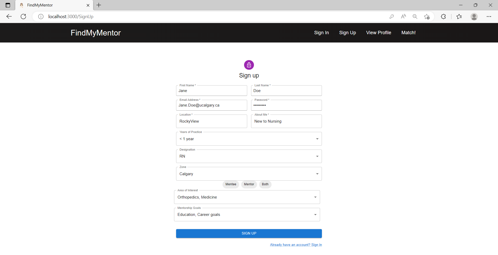
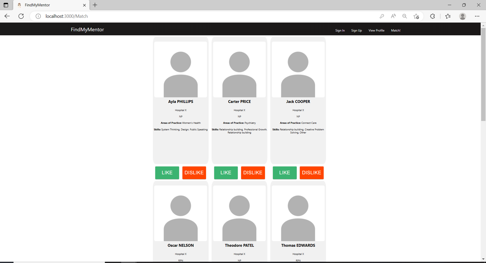

# FindMyMentor
## About

FindMyMentor was developed for a University of Calgary Nurses/Engineering MEng Hackathon. The premise was developed based on a Nursing MEng Term paper to improve the AHS Mentorship program. 

Currently the AHS Nurse Mentorship Network is a cumbersome process that requires a mentee to review a large list of mentors manually and then must go through the process of contacting mentors to find the right fit. FindMyMentor solves these issues by automating the process and instantly pairing the mentee with potential fits. This would rejuvinate this process and help nurses get the meaningful interactions and guidance from others within the industry.

## Stack

This project was built with ReactJS front end. The backend is built with NodeJS and Express utilizing Mongoose to interact with a MongoDB database. 
The application handles JWT internally between the client and server for authentication. 

## How It Works

This is a fullstack application that provides the user with a streamlined interface that matches them to mentors based on their user inputs. A user registers and provides a number of key details, they are then provided with a list of potential matches. 

The user simply registers and fills out their preferences and details as shown below: 

After registering the back end utilizes a matching algorithm to pair the mentor/mentee with ideal matches based on their scope of work, location, experience etc. These criteria were developed in the Nursing research report. 

The user is the presented with a range of potential matches. If fully implemented they would be able to identify users they think are ideal fits, and then begin messaging them and reaching out!

